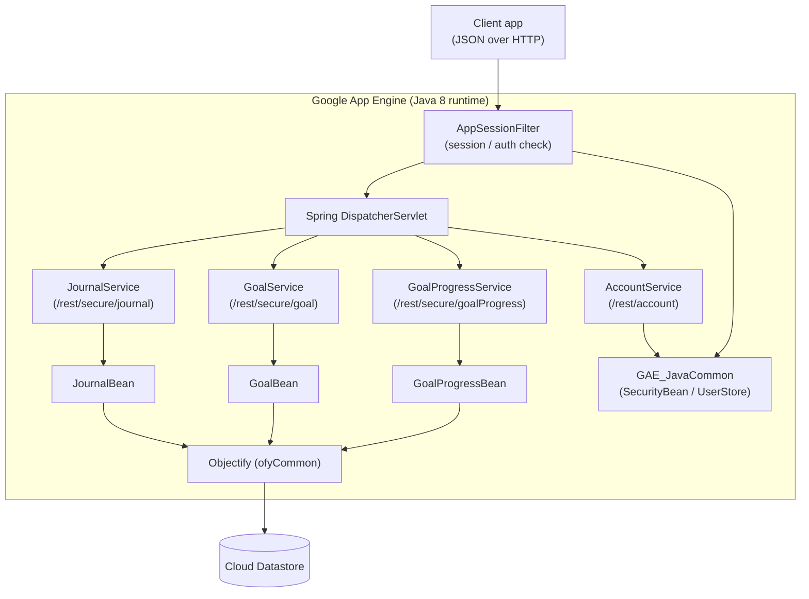

# childDev_java

> A Google App Engine (Java 8) Spring REST backend for tracking child development through journal entries, goals, and goal progress.


## Overview

`childDev_java` is the server-side API for a **child development tracker**. It exposes a JSON
REST API (built with Spring MVC and packaged as a WAR) that runs on the **Google App Engine
standard Java 8 runtime** and persists data to **Cloud Datastore** via the
[Objectify](https://github.com/objectify/objectify) ORM.

The application lets an authenticated account record and retrieve:

- **Journal entries** — point-in-time notes with an activity, location, tags, mood, and free-text notes.
- **Goals** — a goal statement, a measurable outcome, a target/completion date, and a next-meeting date.
- **Goal progress** — progress records tied to goals over time.

Each request is authenticated by a servlet filter, and every read/write is scoped to the
calling account (records carry an `accountFk` ownership key that is checked on every operation).

Authentication, user accounts, and shared utilities are provided by an external sibling Gradle
module, **`GAE_JavaCommon`** (referenced from `../java_common_v2` in `settings.gradle`), which is
**not part of this repository** and must be present alongside it to build.

## Architecture



## Features

- **REST API** for journal entries, goals, and goal progress (create/update, single-fetch,
  time-range fetch by entered-date, batch save, and hard delete).
- **Per-account data isolation** — beans verify the record's `accountFk` against the current
  account before reading, saving, or deleting (`GoalBean`, `JournalBean`, `GoalProgressBean`).
- **Account endpoints** — logon/token retrieval, nickname availability check, current-user lookup,
  registration, and a password-reset stub.
- **Servlet auth filter** (`AppSessionFilter`) that allows `OPTIONS`/whitelisted paths through and
  requires a valid session for any `/secure/` route (returns `401` otherwise).
- **Objectify + Cloud Datastore** entities with `@OnSave` hooks that auto-assign a GUID and stamp
  an `updatedOn` timestamp.
- **Swagger annotations** (`@ApiOperation`, `@ApiModel`) on services and entities for API
  documentation.
- **CORS** enabled (`@CrossOrigin(origins = "*")`) on the REST controllers.

## Tech stack

| Area | Technology |
| --- | --- |
| Language | Java 8 |
| Web framework | Spring Boot 2.1.4 / Spring MVC (`DispatcherServlet`, packaged as WAR) |
| Runtime | Google App Engine standard, `java8` runtime |
| Persistence | Google Cloud Datastore via Objectify 6.0.3 |
| Validation | net.sf.oval 1.84 |
| API docs | Swagger annotations (`io.swagger.annotations`) |
| Build | Gradle (`war`, `appengine`, `spring-boot`, `eclipse` plugins) |
| Testing | JUnit 4, Mockito, Selenium, REST-assured, App Engine testing stubs |
| Shared module | `GAE_JavaCommon` (external, `../java_common_v2`) |

## Project structure

```
childDev_java/
├── build.gradle                 # Gradle build: Spring Boot + App Engine + Objectify
├── settings.gradle              # Includes external GAE_JavaCommon module
├── gradlew / gradlew.bat        # Gradle wrapper
└── src/
    ├── main/
    │   ├── java/com/ackdev/
    │   │   ├── childDev/
    │   │   │   ├── application/  # Bootstrapper, AppConfig, Objectify wiring
    │   │   │   ├── service/      # REST controllers (Account, Journal, Goal, GoalProgress)
    │   │   │   ├── bean/         # Business logic / Datastore access beans
    │   │   │   ├── jdo/          # Objectify entities (JournalItem, GoalItem, ...)
    │   │   │   ├── dto/          # Request/response models
    │   │   │   └── statics/      # Enums (JournalEntryType, ...)
    │   │   ├── filter/security/  # AppSessionFilter, request logging filter
    │   │   ├── store/            # UserStore (per-request account)
    │   │   └── utility/          # Helpers (encryption, utils)
    │   ├── resources/            # application.properties, log4j.properties, static assets
    │   └── webapp/WEB-INF/       # web.xml, appengine-web.xml, cron.xml, datastore-indexes.xml
    └── test/java/               # JUnit tests (beans, services, MVC)
```

## Getting started

### Prerequisites

- **JDK 8** (the App Engine standard Java 8 runtime targets `sourceCompatibility = 1.8`).
- **Google Cloud SDK** with the App Engine Java components, for local run and deploy.
- The **`GAE_JavaCommon`** module checked out at `../java_common_v2` relative to this repo
  (see `settings.gradle`) — the build will fail without it.

### Build

```bash
./gradlew build
```

The build packages a WAR and runs the unit tests (`appengineStage`/`appengineDeploy` depend on `test`).

### Run locally

```bash
./gradlew appengineRun
```

This starts the App Engine local development server (with `automaticRestart` enabled).

### Deploy

```bash
./gradlew appengineDeploy
```

Deploys to the App Engine application configured in `src/main/webapp/WEB-INF/appengine-web.xml`
(`<application>child-dev</application>`, runtime `java8`). Update the application ID and version
there before deploying to your own project.

## Configuration

- **`src/main/webapp/WEB-INF/appengine-web.xml`** — App Engine application ID (`child-dev`),
  runtime (`java8`), version, threadsafe/session settings, static-file caching, and logging config.
- **`src/main/webapp/WEB-INF/web.xml`** — servlet/filter wiring: the Objectify filter, the Spring
  `DispatcherServlet` (with `AppConfig` as the context config), and `AppSessionFilter`.
- **`src/main/resources/application.properties`** — Spring properties (`spring.jmx.enabled=false`).
- **`src/main/resources/log4j.properties`** / **`WEB-INF/logging.properties`** — logging configuration.
- **`src/main/webapp/WEB-INF/datastore-indexes.xml`**, **`cron.xml`**, **`queue.xml`** —
  Datastore indexes and (currently empty) cron/task-queue definitions.

## REST API surface

| Method | Path | Purpose |
| --- | --- | --- |
| `GET` | `/rest/account/token/{logon}/{password}` | Log on, return account token |
| `GET` | `/rest/account/checkNameAvailable/{logon}` | Check nickname availability |
| `GET` | `/rest/account/secure/getUser` | Get the current account |
| `POST` | `/rest/account/register` | Register a new user |
| `POST` | `/rest/account/resetPW` | Reset password (stub) |
| `GET` | `/rest/secure/journal/{guid}` | Fetch a journal entry |
| `GET` | `/rest/secure/journal/range/{startTS}/{endTS}` | Fetch entries by entered-date range |
| `POST` | `/rest/secure/journal` (and `/batch`) | Save one or many journal entries |
| `DELETE` | `/rest/secure/journal/hardDelete/{guid}` | Hard delete a journal entry |
| `GET`/`POST`/`DELETE` | `/rest/secure/goal/...` | Goal CRUD (same shape as journal) |
| `GET`/`POST`/`DELETE` | `/rest/secure/goalProgress/...` | Goal progress CRUD |

<sub>README authored by Claude.</sub>
